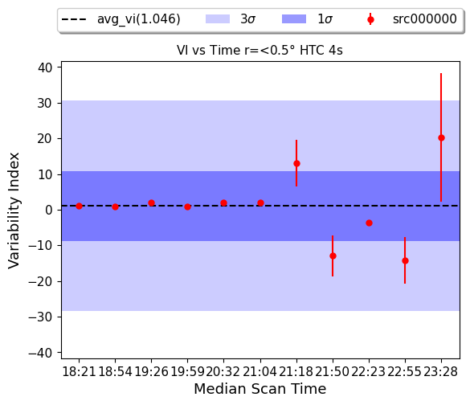

# MeerKAT STV Analysis of PKS J2152-2828

This repository contains the analysis for investigating the **Short-Term Variability (STV)** of the calibrator PKS J2152-2828 using preexisting MeerKAT data.

## Project Overview
This project focuses on quantifying the short-term flux density stability of a calibrator in use in MeerKAT's UHF band. Accurate calibration is a cornerstone of high-dynamic-range imaging and accurate scientific analysis; therefore, understanding the intrinsic variability of these sources is crucial in distinguishing between instrumental effects and real astrophysical signals that may impact calibration.

### Key Features
* **Variability Metrics:** Calculation of the Variability Index ($\mathrm{VI}$) and statistics per scan to identify statistically significant fluctuations.
* **E.g Scan ($\mathrm{VI}$):**

